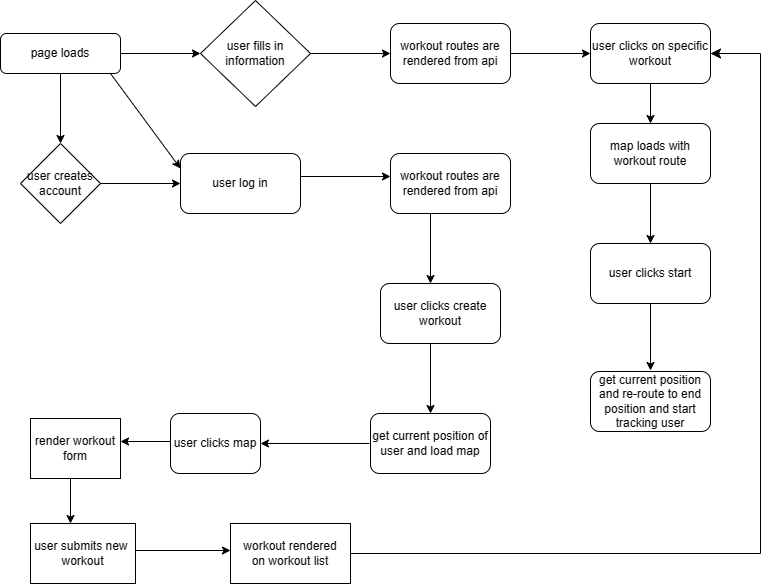

# Mapty
Mapty is a workout app that lets you create and track your running and cycling routes. To start using the app visit the link, create an account and login.
To create a route click on create route and click on the map to choose end destination. Fill in the form and submit and a route will be created an appear
on the routes list.
Click on a route to load it on the map and click start to start your workout.
## mapty-flowchart

To see how the app works clone the repository and run npm install. Execute the requirements.txt folder. 
In one terminal start the api server using python3 manage.py runserver and in another start the react app using npm start. Create an account, login, and create some
workout routes.
